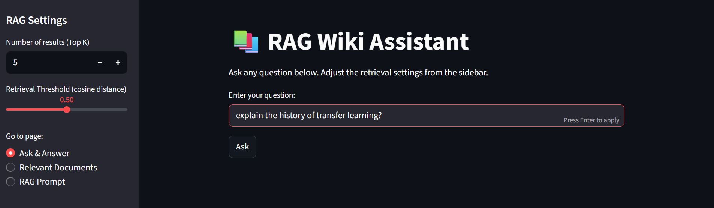
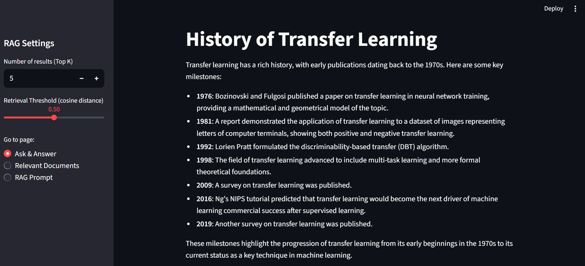
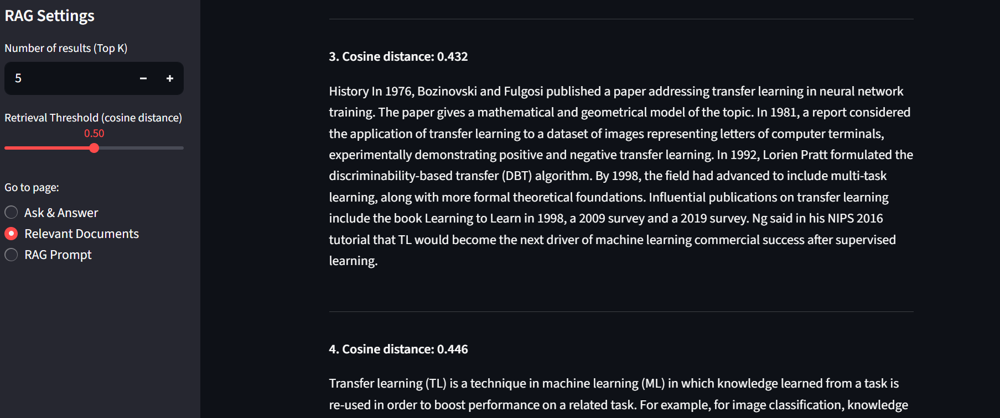
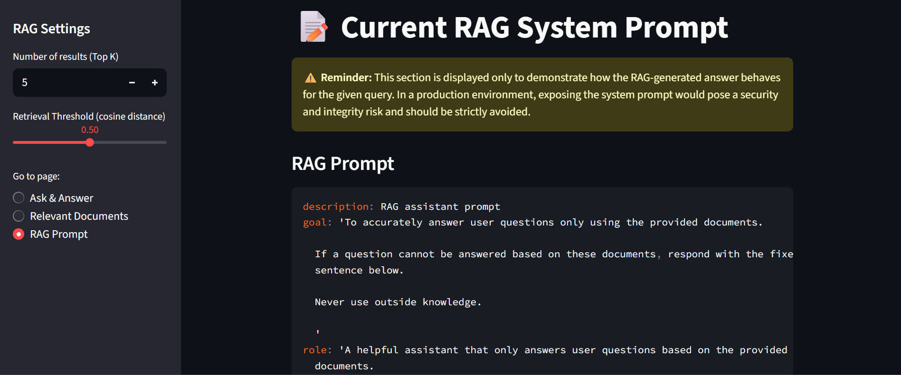
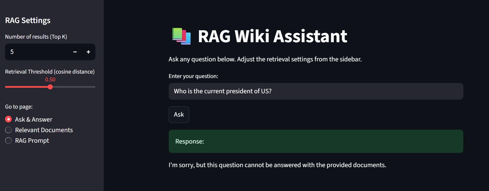

# RAG Wiki Assistant – Transparent Retrieval-Augmented Generation App
> An interactive Streamlit app for asking AI/ML and LLM related questions, retrieving relevant documents, and inspecting the underlying RAG prompt.

---

## 📝 1. Overview / Introduction

RAG Wiki Assistant is a **Retrieval-Augmented Generation (RAG) application** built using **Python** and **Streamlit**.  
It combines **document retrieval** and **LLM-based answer generation** to provide **contextual and transparent responses** to user queries.

### Key points:
- The app answers questions **only based on the data it is given**.  
  For this project, the knowledge base consists of **Wikipedia pages related to AI, Machine Learning, and LLM articles**.  
- Users can ask a question, inspect supporting documents, and see the final RAG prompt (for debugging).  
- With slight tweaks to the **system prompt** and the **documents provided to the vector DB**, this pipeline can be adapted for **any basic RAG project**.

> ⚠️ This project is made for  **for demonstration and educational purposes only.**. In a production environment, exposing the RAG prompt can compromise **security and system integrity** and should be strictly avoided.

### Target Audience
* This project is ideal for **AI/ML enthusiasts, developers, and students** who want to understand or demonstrate a minimal and simple **Retrieval-Augmented Generation (RAG) pipeline**.

## 🚀 2. Features

- **Interactive Q&A:** Users ask questions and get LLM-generated answers based on the provided documents for the knowledge base.
- **Document Retrieval View:** View top-n retrieved documents along with their **cosine distances**.  
- **Prompt Debugging:** Inspect the RAG prompt .  
- **Configurable Retrieval:** Adjust the **number of results (Top K)** and **retrieval threshold**.  
- **Adaptable Pipeline:** By changing the system prompt and the documents, the same app structure can be used for other RAG setups.

## 🏗️ 3. Architecture
```rust
User Query --> Query Embedding --> Similarity Search in Vector DB --> Retrieve Top N Documents -> LLM Answer Generation --> Display in App
```

## 📂 4. Project Structure
```yaml
rag-wiki-assistant/
    ├─ app/
    │   └─ app.py # Main Streamlit application
    ├─ code/
    │    └─ config/
    │        ├─ config.yaml # App-level settings
    │        └─ prompt_config.yaml # RAG prompts
    │    ├─ data_extraction.py # Extracts the relevant wikipedia articles using wikipediaapi in .txt format
    │    ├─ loader.py # Loads YAML configuration files
    │    ├─ logger.py # Minimal logging setup
    │    ├─ prompt.py # Prompt builder 
    │    ├─ retrieval_and_response.py # Handles retrieval & LLM response
    │    ├─ vectordb_and_ingestion.py # Initializes the VectorDB and Feeds the files to ChromaDB 
    ├─ data/ # Holds 25 .txt files
    ├─ images/ # Screenshots of app results
    ├─ requirements.txt # Python dependencies
    ├─ .gitignore 
    ├─ LICENSE # MIT License
    └─ README.md
```
## 💻 5. Installation / Setup

### Prerequisites
* **Python** >= 3.10
* **Streamlit** installed (`pip install streamlit`)
* A **GROQ API key** stored in a `.env` file in the project root
### Steps
```bash
# Clone the repository
git clone https://github.com/Leoul39/rag-wiki-assistant.git
cd rag-wiki-assistant

# Create virtual environment
python -m venv .venv
# Activate venv (Windows)
.venv\Scripts\activate
# Or (Mac/Linux)
source .venv/bin/activate

# Install dependencies
pip install -r requirements.txt

```
## ▶️ 6. Running the App
* Once all dependencies are installed, you can start the app using Streamlit to interact with the RAG pipeline in real time.
> Make sure to run the line below in the **root directory**.
```bash
streamlit run app/app.py
```
- This will open a new tab in your default browser at a URL similar to `http://localhost:8501`.
## 📊 7. Demonstration
- The app is consturcted in 3 different pages

    1. **Page 1 - Ask & Answer** - User queries and LLM response
    2. **Page 2 - Relevant Documents** - Showing n_results relevant documents in ascending order of **cosine distances**.
    3. **Page 3 - RAG Prompt** - System prompt of the RAG 
* Let's first ask it a relevant question to the knowledge base



* Transfer learning is a concept in machine learning so it should answer well. Also, it is found in the data I attached to the RAG (**See `data` folder**)
* The answer it provides is as follows:



* As you can see, it is showing relevant historical points to the user's query. It is also using bullet points as provided in the **style_or_tone** of `prompt_config.yaml` configuration module.
* Let's see what the relevant documents are for the user's query 



* As depicted in the image, the relevant documents are pulled using cosine distances.

* Let's now showcase the RAG Prompt. 
> As said before, exposing the RAG prompt is **dangerous** in production. It is shown here for **educational purposes**.



* Let's now ask an irrelevant question to the RAG to see how it behaves



* It is responding exactly as it should. It is not hallucinating answer that doesn't exist in the database, instead it is showing a clear line that says "I'm sorry, but this question cannot be answered with the provided documents", as provided in the **instruction** of the `prompt_config.yaml` configuration module.

## 🏗️ 8. Technologies Used
1. **Python** – Core programming language powering the app.
2. **Streamlit** – For building the interactive UI with multiple pages.
3. **ChromaDB** – Vector database to store and retrieve embedded documents.
4. **LangChain Text Splitter** – For chunking Wikipedia pages into smaller, searchable segments.
5. **LangChain Hugging Face Embeddings** – To embed both documents and queries into the same vector space for similarity search.
6. **GROQ API** – Used as the LLM provider for generating final answers.

## 📄 9. License

* **This project is licensed under MIT License – see LICENSE for details.**

## 🙋 10. Contact Me
* **Author** - **Leoul Teferi**
* **Email** - leoulteferi1996@gmail.com


